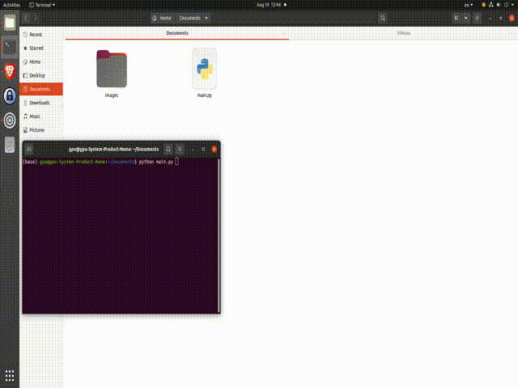

<!DOCTYPE html>
<html>
<body>
  <h1>FastA</h1>
  
  <h2>Introduction:</h2>
  
This code allows you to make certain areas of an image black by specifying the region of interest. The code is written in Python and uses the OpenCV library for image processing.

  
  <h2>Prerequisites:</h2>
  
To use this code, you need the following:

  <ul>
    <li>Python 3.x installed on your system</li>
    <li>The OpenCV library</li>
  </ul>
  
  Feel free to explore and modify the code to suit your specific requirements.

  
   

</body>
</html>
